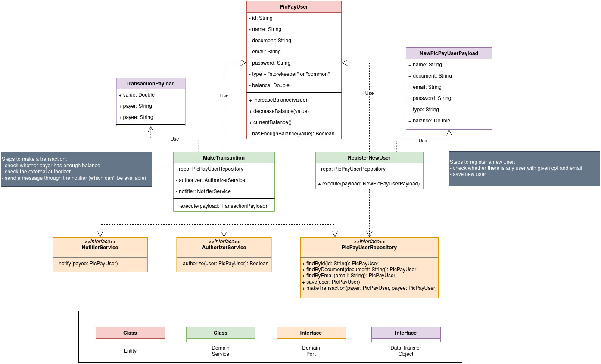

# PicPay backend challenge

This repository was made following [this instructions here](https://github.com/PicPay/picpay-desafio-backend).

## How to run

- To build the application docker image:
```bash
docker-compose build
```

- To run both application and database:
```bash
docker-compose up
```

- To run the application tests:
```shell
docker-compose exec app ./gradlew test
```

The containers need some environment variables. The file `.env.sample` shows those variables. Once you clone this repo, you need to create a `.env` file with the same variables in `.env.sample` and their values.

## Documentation

### Technologies

- Kotlin: expressive programming language leaner than Java.
- Spring Boot Framework: to create the Web API and to facilitate dependency injection. It also has some easier ways to handle with infrastructures such as Databases.
- MongoDB: NoSQL database to store the PicPay users info.

### RESTful API and its endpoints

This web service is running on port 8080. It exposes the following endpoints:

```bash
POST /transactions    # to make a transaction between two picpay users
POST /users           # to register a new PicPay user
```

For the first endpoint, the JSON request body below serves as an example. Both payer and payee in the JSON are the IDs of PicPay users.
```json
{
  "value": 110.7,
  "payer": "abcd123",
  "payee": "89h42b4"
}
```

For the second endpoint, the JSON request body below serves as an example. The "document" value can be either a CPF or a CNPJ. The "type" value can be either "common" or "storekeeper". 
```json
{
  "name": "Erick",
  "document": "123.123.123-12",
  "email": "erick@erick.com",
  "password": "123456",
  "type": "common",
  "balance": 120.42
}
```


### Architecture, Directory Structure, and Domain Class Diagram

This repository was made following the [Hexagonal Architecture](https://alistair.cockburn.us/hexagonal-architecture/) (or Ports and Adapter).
This means that the code follows the generic architecture below:


This repo also uses some concepts of [DDD](https://martinfowler.com/tags/domain%20driven%20design.html) (Domain Driven Design) such as Entities, Value Objects and Domain Services.

The main code is located on `src/main/kotlin/com.erickrodrigues.picpay`. Inside this folder, the application has the following directory structure:

```
application/
   controllers/
   factories/
   infrastructure/
   services/
domain/
   dto/            
   entities/
   exceptions/
   ports/               # Domain ports
   services/            # Domain services
   types/               # DDD's value objects
```

The application directory has all applications dependencies: framework, database, and so on. The application layer contains the controllers (which handle with routes), factories of objects, data access objects and the adapters of the domain ports. The application layer uses the domain to perform the business logic.

The domain directory is the heart of the system. It has all the business logic and has no external dependencies. The class diagram below shows entities, services and port interfaces of the domain (aka the business logic).



